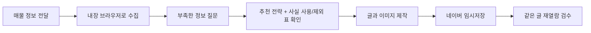

# Realtor Naver Blog

**매물 정보를 건네면, 내 말투에 맞는 네이버 블로그 글을 임시저장까지.**

공인중개사를 위한 Codex 스킬입니다. 매물의 장점을 누구에게 어떻게 설명할지 먼저 함께 정하고, 사진·조건표·상담 안내가 들어간 글을 만들어 네이버 블로그에 임시저장합니다.

**브라우저는 Codex 내장 브라우저 하나만 씁니다.** 매물 수집·로그인·입력·사진 업로드·저장·검수를 모두 Codex 안의 브라우저에서 합니다. Chrome 설치나 별도 부품(Playwright·Chromium) 다운로드가 필요 없습니다.

**처음이라면 아래 ① 설치 요청 → ② 첫 매물 요청 순서로 따라 하세요.**

[처음부터 따라 하기](docs/first-post.md) · [막혔을 때 해결하기](docs/troubleshooting.md) · [직접 설치하기](docs/manual-install.md) · [ZIP으로 설치하기](docs/zip-install.md)

## 시작하기 전에 준비할 것

| 준비할 것 | 어디에 쓰나요? |
|---|---|
| Codex 앱 + Browser 플러그인(내장 브라우저) 켜기 | 매물 수집, 네이버 입력·저장을 합니다. |
| 내 네이버 블로그 주소 | 글을 저장하고 기존 글의 말투를 참고합니다. |
| 매물번호, 매물 링크, 또는 매물 설명·사진 | 글의 근거가 됩니다. |
| 사무소명과 공개 상담 연락처 | 글 끝의 상담 안내와 배너에 사용합니다. |

Node.js 20 이상이 필요합니다. 그 밖에 설치할 부품은 없습니다.

## ① 처음 한 번: 설치 요청하기

Codex의 새 대화에 아래 문장을 **그대로 복사해서 보내세요.**

```text
$skill-installer
https://github.com/eziwork/realtor-naver-blog 저장소의
realtor-naver-blog 폴더를 스킬로 설치해줘.

이 스킬은 Codex 내장 브라우저 전용이라 npm install이나 Playwright·Chromium 설치가 필요 없어.
Node.js 20 이상인지, 내장 브라우저(Browser 플러그인)를 쓸 수 있는지만 확인해줘.
이미 같은 이름의 스킬이 있으면 이 버전으로 교체하고, 기존 사무소 프로필과 블로그 문체 설정은 보존해줘.
설치가 끝나면 내가 다음에 입력할 문장을 알려줘.
```

설치 후 새 대화에서 `$realtor-naver-blog`를 입력해 보세요. 보이지 않으면 Codex를 다시 시작하세요. GitHub 접속이 막힌 곳(수업장 등)에서는 [ZIP으로 설치하기](docs/zip-install.md)를 따르세요.

## ② 첫 매물: 빈칸만 채워 요청하기

`[대괄호]` 부분을 본인 정보로 바꿔 보내세요. 비밀번호나 인증번호는 적지 않습니다.

```text
$realtor-naver-blog

처음 사용합니다. 아래 매물로 네이버 블로그 글을 만들고 싶어요.

매물: [네이버 매물번호 또는 매물 상세 링크]
내 블로그: https://blog.naver.com/[내 블로그 ID]
사무소명: [글에 표시할 사무소명]
담당자명: [표시할 이름, 생략 가능]
상담 연락처: [공개 가능한 전화번호]

부족한 정보는 글을 쓰기 전에 질문해 주세요.
추천 전략을 먼저 보여주고, 제가 확정하면 글을 작성해
사진·썸네일·상담 배너를 업로드해 임시저장한 뒤 같은 글을 다시 열어 검수해 주세요.
```

- 매물번호가 없으면 말로 설명하고 사진 폴더를 알려줘도 됩니다. [입력 예시 3종](docs/first-post.md)
- 지도 공유 링크(`fin.land.naver.com/map?...`)에는 매물번호가 없어서, 상세 링크나 번호를 한 번 더 묻습니다.
- 마지막 문장의 "업로드해"는 내장 브라우저가 파일 업로드 전에 요구하는 사전 동의입니다. 빠지면 업로드 직전에 한 번 더 묻습니다.

## 요청한 다음에는 무엇을 하나요?



| Codex가 하는 일 | 사용자가 할 일 |
|---|---|
| 내장 브라우저로 매물 정보와 **사진 전체**를 가져오고 장수를 대조합니다. 모자라면 멈추고 알려줍니다. | 사진이 부족하다고 하면 보완하거나 확보분으로 진행할지 답합니다. |
| 확인된 정보와 필요한 질문을 정리합니다. | 아는 정보를 답합니다. 모르는 항목은 제외해 달라고 할 수 있습니다. |
| 누구에게 어떤 장점을 전할지 추천하고, **확인된 사실마다 쓸지 뺄지와 이유**를 보여줍니다. | 마음에 들면 “이 전략으로 진행해줘”, 빠진 게 있으면 “그것도 넣어”라고 답합니다. |
| 내 말투로 원고·사진 배치·표·배너를 만듭니다. | 원하는 말투나 강조점이 있으면 알려줍니다. |
| 내장 브라우저로 네이버에 접속합니다. | 로그인이 필요하면 내장 브라우저 창에서 직접 로그인합니다. |
| 저장하자마자 "임시저장했어요(검증 중)"라고 먼저 알리고, 저장된 글을 다시 열어 원본과 자동 비교한 뒤 "검증이 끝났어요"라고 다시 알립니다. | 중간 알림이 오면 글을 먼저 열어 봐도 됩니다. 최종 알림 후 발행 여부를 결정합니다. |

글은 **임시저장 상태**로 남습니다. 공개 발행은 사용자가 최종 검토 후 직접 진행합니다.

## 어떤 글이 만들어지나요?

- 매물과 독자에게 맞는 제목과 도입
- 공간 설명 옆에 배치한 매물 사진 — **기본은 받은 사진 전부**(완전 중복·흔들림·무관한 사진만 이유를 남기고 제외)
- 가격·면적·입주시기 등 확인된 조건을 정리한 표
- 썸네일과 사무소 상담 배너(탭하면 전화 연결, 사무소 정보가 같으면 재사용)
- 문의하면 무엇을 안내받는지 설명하는 상담 문구와 연락처
- 위치가 정확히 확인된 경우 지도

기본은 편안한 존댓말과 짧은 문장입니다. 글자는 본문 16px, 소제목 24px 굵게, 조건표 15px로 맞춥니다. 한 문장마다 문단을 나누고, 문장 사이에 빈 줄 한 줄을 두며, 본문·소제목·사진 설명·표·연락처를 가운데 정렬합니다. 기존 블로그의 공개 매물 글을 최대 5개 읽어 문체를 저장할 수 있습니다.

## 믿고 확인할 수 있는 작업 원칙

**필요한 정보는 쓰기 전에 묻습니다.** 답이 없는 항목은 글에서 제외하며, 고객용 글에 “모른다”, “미확인” 같은 수집 상태를 적지 않습니다.

**사실을 이유 없이 빼지 않습니다.** 전략과 함께 확인된 사실 전부의 사용/제외와 이유를 보여줍니다.

**같은 글을 다시 열어 확인합니다.** 제목·본문·사진 순서·표·지도·연락처를 대조하고, 저장 상태와 완성도를 함께 보고합니다.

**삭제 버튼은 절대 누르지 않습니다.** 임시저장 목록의 ‘전체 삭제’ 실사고 이후 지킨 원칙입니다. 정리는 사람이 합니다.

**작업이 끊겨도 이어서 합니다.** 원고와 사진은 `~/.codex/naver-realtor-blog/runs/`에 남아 스킬을 다시 설치해도 지워지지 않습니다.

검색어는 매물과 독자를 고려한 추천 후보입니다. 실시간 검색량이나 상위 노출·문의 증가를 보장하지 않습니다.

## 두 번째 매물부터는 더 짧게

```text
$realtor-naver-blog
매물 [새 매물번호 또는 링크]로 진행해줘.
사무소 정보와 문체는 지난번과 같아. 추천 전략부터 보여줘.
```

## 이전 버전을 쓰던 분

- **v0.3(Playwright 수집기 포함)**: 같은 이름이라 위 ① 설치 요청으로 교체하면 됩니다. v0.3은 태그 [`v0.3.0`](https://github.com/eziwork/realtor-naver-blog/tree/v0.3.0)으로 보관돼 있습니다.
- **`naver-realtor-blog-pro`**: 이름이 달라 함께 설치돼 있어도 충돌하지 않습니다. 사무소 프로필은 같은 파일을 이어 씁니다. 새 글은 `$realtor-naver-blog`로 지정하세요.

## 더 자세한 안내

| 읽을 문서 | 이런 분께 필요합니다 |
|---|---|
| [첫 글 따라 하기](docs/first-post.md) | 각 단계에서 무엇을 답할지, 입력 예시 3종 |
| [문제 해결](docs/troubleshooting.md) | 설치·사진 수집·로그인·저장에서 막혔을 때 |
| [직접 설치](docs/manual-install.md) · [ZIP 설치](docs/zip-install.md) | 명령어나 ZIP으로 설치할 때 |
| [실제 테스트 순서](TESTING.md) | 새 버전을 Codex 앱에서 직접 확인할 때 |
| [변경 내역](CHANGES.md) | 무엇이 왜 바뀌었는지 |
| [스킬 작업 지침](realtor-naver-blog/SKILL.md) · [수집 절차](realtor-naver-blog/references/browser-collect.md) | 동작 원칙을 읽거나 수정할 때 |

## 검증과 출처

저장소 루트에서 `npm test`(59개)와 `node realtor-naver-blog/scripts/check-core.mjs`로 확인합니다. 내장 브라우저 동작은 코드 테스트로 확인할 수 없어 [TESTING.md](TESTING.md)대로 Codex 앱에서 확인합니다.

[Dr-Min/naver-realtor-blog-pro](https://github.com/Dr-Min/naver-realtor-blog-pro)의 수집·전송 실측 교훈과 Eziwork v0.3의 전략 확정·문체·재열람 흐름을 합쳤습니다. OpenAI나 네이버의 공식 제품은 아닙니다.
